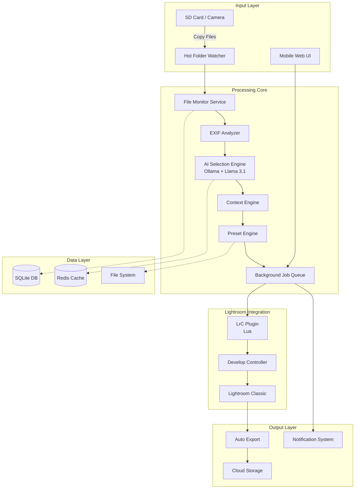
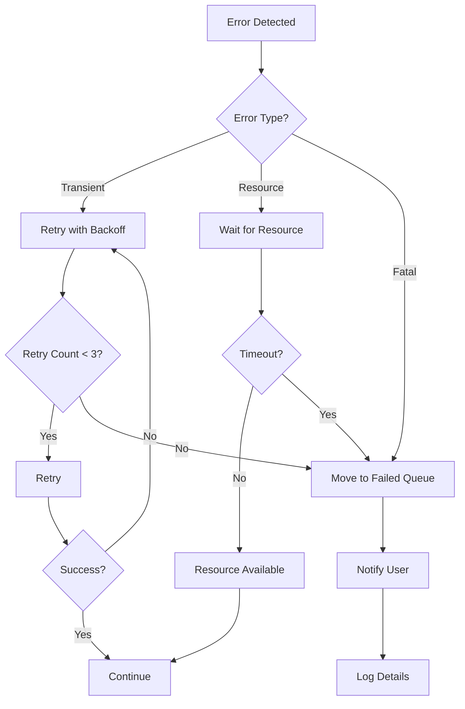

タスクに関して
pythonでテストを行う際には、python test・・・といった形ではなく
py ・・・で行うようにする
# Design Document

## Overview

本設計書は、Junmai AutoDev システムの革新的な業務効率化機能の詳細設計を定義します。現在のシステムは基本的な自動現像機能を提供していますが、本設計では写真家の実際のワークフロー（撮影→取り込み→選別→現像→書き出し）全体を自動化・最適化します。

### Design Philosophy

1. **ゼロタッチ自動化**: 可能な限り人間の介入を減らし、バックグラウンドで処理を完結
2. **コンテキスト認識**: 撮影状況を自動判定し、最適な処理を適用
3. **非同期・並行処理**: 他業務と並行して写真処理を進行
4. **完全無料・ローカル**: OSS LLM（Ollama + Llama）使用、APIキー不要
5. **GPU最適化**: RTX 4060 8GB VRAMを効率的に活用

### Key Innovations

- **ホットフォルダー監視**: SDカードからコピーするだけで自動処理開始
- **AI自動選別**: 数百枚から良い写真を自動抽出（選別時間90%削減）
- **スマート現像**: 撮影コンテキストに基づく自動プリセット選択
- **バックグラウンドエンジン**: Lightroom非起動時も処理継続
- **モバイル連携**: スマホから進捗確認・承認可能

## Architecture

### System Components




### Component Descriptions

#### 1. Hot Folder Watcher (ホットフォルダー監視)
- **Technology**: Python `watchdog` library
- **Function**: 指定フォルダを5秒間隔で監視、新規RAW/JPEG検知
- **Trigger**: ファイル作成完了（書き込み終了）を検知後、処理開始


#### 2. EXIF Analyzer (メタデータ解析)
- **Technology**: Python `exifread` + `piexif`
- **Extracted Data**:
  - 撮影日時、カメラ設定（ISO、シャッター速度、絞り）
  - GPS位置情報（屋外/室内判定）
  - レンズ情報（焦点距離から被写体タイプ推定）
- **Output**: 構造化メタデータJSON

#### 3. AI Selection Engine (AI自動選別)
- **Technology**: 
  - Ollama + Llama 3.1 8B（テキスト解析）
  - OpenCV + ONNX Runtime（画像品質評価）
  - CLIP（画像内容理解）
- **Evaluation Criteria**:
  - ピント精度（Laplacian variance）
  - 露出適正（ヒストグラム分析）
  - 構図バランス（Rule of thirds）
  - 顔検出・表情評価（OpenCV DNN）
- **Output**: 1-5星評価 + 推奨タグ

#### 4. Context Engine (コンテキスト認識)
- **Input**: EXIF + AI分析結果
- **Logic**:
  ```python
  if time_of_day == "golden_hour" and subject == "portrait":
      context = "backlit_portrait"
  elif location == "indoor" and iso > 1600:
      context = "low_light_indoor"
  elif subject == "landscape" and sky_detected:
      context = "landscape_sky"
  ```
- **Output**: コンテキストタグ（20種類の定義済みシナリオ）

#### 5. Preset Engine (プリセット選択)
- **Mapping**: コンテキスト → プリセット
- **Example**:
  - `backlit_portrait` → `WhiteLayer_Transparency_v4` (blend: 60%)
  - `low_light_indoor` → `LowLight_NR_v2` (blend: 80%)
- **Customization**: ユーザー学習データに基づく動的調整

#### 6. Background Job Queue (バックグラウンドキュー)
- **Technology**: Python `celery` + Redis
- **Priority Levels**:
  - High: ユーザー手動投入ジョブ
  - Medium: 自動選別で4-5星の写真
  - Low: 3星以下の写真
- **Resource Management**:
  - CPU使用率 > 80% → 処理速度を50%に制限
  - GPU温度 > 75°C → 処理一時停止
  - アイドル検知 → 最大速度で処理

#### 7. Lightroom Plugin (Lua)
- **Enhanced Features**:
  - WebSocket接続（ポーリングから双方向通信へ）
  - 処理進捗のリアルタイム送信
  - バッチ処理の中断・再開
  - エラー詳細のキャプチャ

#### 8. Auto Export Pipeline (自動書き出し)
- **Presets**:
  - SNS用: 長辺2048px、JPEG 85%、sRGB
  - 印刷用: 長辺4096px、JPEG 95%、Adobe RGB
  - アーカイブ用: 元サイズ、TIFF 16bit
- **Destinations**:
  - ローカルフォルダ
  - Dropbox / Google Drive（rclone経由）
  - FTP/SFTP

#### 9. Notification System (通知)
- **Channels**:
  - デスクトップ通知（Windows Toast / macOS Notification Center）
  - メール（SMTP）
  - LINE Notify（オプション）
  - モバイルプッシュ（PWA）
- **Events**:
  - 処理完了（バッチ単位）
  - エラー発生（即座）
  - 承認要求（1時間ごとにまとめて）

## Data Models

### Database Schema (SQLite)

```sql
-- セッション管理
CREATE TABLE sessions (
    id INTEGER PRIMARY KEY AUTOINCREMENT,
    name TEXT NOT NULL,
    created_at TIMESTAMP DEFAULT CURRENT_TIMESTAMP,
    import_folder TEXT,
    total_photos INTEGER DEFAULT 0,
    processed_photos INTEGER DEFAULT 0,
    status TEXT CHECK(status IN ('importing', 'selecting', 'developing', 'exporting', 'completed'))
);

-- 写真メタデータ
CREATE TABLE photos (
    id INTEGER PRIMARY KEY AUTOINCREMENT,
    session_id INTEGER REFERENCES sessions(id),
    file_path TEXT UNIQUE NOT NULL,
    file_name TEXT NOT NULL,
    file_size INTEGER,
    import_time TIMESTAMP DEFAULT CURRENT_TIMESTAMP,
    
    -- EXIF データ
    camera_make TEXT,
    camera_model TEXT,
    lens TEXT,
    focal_length REAL,
    aperture REAL,
    shutter_speed TEXT,
    iso INTEGER,
    capture_time TIMESTAMP,
    gps_lat REAL,
    gps_lon REAL,
    
    -- AI評価
    ai_score REAL CHECK(ai_score BETWEEN 1 AND 5),
    focus_score REAL,
    exposure_score REAL,
    composition_score REAL,
    subject_type TEXT,
    detected_faces INTEGER DEFAULT 0,
    
    -- コンテキスト
    context_tag TEXT,
    selected_preset TEXT,
    
    -- 処理状態
    status TEXT CHECK(status IN ('imported', 'analyzed', 'queued', 'processing', 'completed', 'failed', 'rejected')),
    lr_catalog_id TEXT,
    virtual_copy_id TEXT,
    
    -- 承認
    approved BOOLEAN DEFAULT FALSE,
    approved_at TIMESTAMP,
    rejection_reason TEXT
);

-- ジョブキュー
CREATE TABLE jobs (
    id TEXT PRIMARY KEY,
    photo_id INTEGER REFERENCES photos(id),
    priority INTEGER CHECK(priority IN (1, 2, 3)),
    config_json TEXT NOT NULL,
    status TEXT CHECK(status IN ('pending', 'processing', 'completed', 'failed')),
    created_at TIMESTAMP DEFAULT CURRENT_TIMESTAMP,
    started_at TIMESTAMP,
    completed_at TIMESTAMP,
    error_message TEXT,
    retry_count INTEGER DEFAULT 0
);

-- プリセット管理
CREATE TABLE presets (
    id INTEGER PRIMARY KEY AUTOINCREMENT,
    name TEXT UNIQUE NOT NULL,
    version TEXT NOT NULL,
    context_tags TEXT, -- JSON array
    config_template TEXT NOT NULL, -- JSON
    blend_amount INTEGER DEFAULT 100,
    usage_count INTEGER DEFAULT 0,
    avg_approval_rate REAL,
    created_at TIMESTAMP DEFAULT CURRENT_TIMESTAMP,
    updated_at TIMESTAMP DEFAULT CURRENT_TIMESTAMP
);

-- 統計データ
CREATE TABLE statistics (
    id INTEGER PRIMARY KEY AUTOINCREMENT,
    date DATE NOT NULL,
    session_id INTEGER REFERENCES sessions(id),
    total_imported INTEGER DEFAULT 0,
    total_selected INTEGER DEFAULT 0,
    total_processed INTEGER DEFAULT 0,
    total_exported INTEGER DEFAULT 0,
    avg_processing_time REAL,
    success_rate REAL,
    preset_usage TEXT -- JSON object
);

-- ユーザー学習データ
CREATE TABLE learning_data (
    id INTEGER PRIMARY KEY AUTOINCREMENT,
    photo_id INTEGER REFERENCES photos(id),
    action TEXT CHECK(action IN ('approved', 'rejected', 'modified')),
    original_preset TEXT,
    final_preset TEXT,
    parameter_adjustments TEXT, -- JSON
    timestamp TIMESTAMP DEFAULT CURRENT_TIMESTAMP
);

CREATE INDEX idx_photos_session ON photos(session_id);
CREATE INDEX idx_photos_status ON photos(status);
CREATE INDEX idx_jobs_status ON jobs(status);
CREATE INDEX idx_jobs_priority ON jobs(priority);
CREATE INDEX idx_statistics_date ON statistics(date);
```

### Configuration Files

#### config.json (システム設定)
```json
{
  "version": "2.0",
  "system": {
    "hot_folders": [
      "D:/Photos/Inbox",
      "E:/SD_Card_Import"
    ],
    "lightroom_catalog": "D:/Lightroom/Catalog.lrcat",
    "temp_folder": "C:/Temp/JunmaiAutoDev",
    "log_level": "INFO"
  },
  "ai": {
    "llm_provider": "ollama",
    "llm_model": "llama3.1:8b-instruct",
    "ollama_host": "http://localhost:11434",
    "gpu_memory_limit_mb": 6144,
    "enable_quantization": false,
    "selection_threshold": 3.5
  },
  "processing": {
    "auto_import": true,
    "auto_select": true,
    "auto_develop": true,
    "auto_export": false,
    "max_concurrent_jobs": 3,
    "cpu_limit_percent": 80,
    "gpu_temp_limit_celsius": 75
  },
  "export": {
    "presets": [
      {
        "name": "SNS",
        "enabled": true,
        "format": "JPEG",
        "quality": 85,
        "max_dimension": 2048,
        "color_space": "sRGB",
        "destination": "D:/Export/SNS"
      },
      {
        "name": "Print",
        "enabled": false,
        "format": "JPEG",
        "quality": 95,
        "max_dimension": 4096,
        "color_space": "AdobeRGB",
        "destination": "D:/Export/Print"
      }
    ],
    "cloud_sync": {
      "enabled": false,
      "provider": "dropbox",
      "remote_path": "/Photos/Processed"
    }
  },
  "notifications": {
    "desktop": true,
    "email": {
      "enabled": false,
      "smtp_server": "smtp.gmail.com",
      "smtp_port": 587,
      "from_address": "user@example.com",
      "to_address": "user@example.com"
    },
    "line": {
      "enabled": false,
      "token": ""
    }
  },
  "ui": {
    "theme": "dark",
    "language": "ja",
    "show_advanced_settings": false
  }
}
```

## Components and Interfaces

### 1. Hot Folder Service

**Class**: `HotFolderWatcher`

```python
class HotFolderWatcher:
    def __init__(self, folders: List[str], callback: Callable):
        self.folders = folders
        self.callback = callback
        self.observer = Observer()
        
    def start(self):
        """監視開始"""
        for folder in self.folders:
            event_handler = FileEventHandler(self.callback)
            self.observer.schedule(event_handler, folder, recursive=True)
        self.observer.start()
        
    def stop(self):
        """監視停止"""
        self.observer.stop()
        self.observer.join()

class FileEventHandler(FileSystemEventHandler):
    def on_created(self, event):
        if event.is_directory:
            return
        if self._is_image_file(event.src_path):
            # ファイル書き込み完了を待機
            self._wait_for_file_ready(event.src_path)
            self.callback(event.src_path)
```

**API Endpoints**:
- `POST /api/hotfolder/add` - 監視フォルダ追加
- `DELETE /api/hotfolder/remove` - 監視フォルダ削除
- `GET /api/hotfolder/status` - 監視状態取得

### 2. EXIF Analyzer

**Class**: `EXIFAnalyzer`

```python
class EXIFAnalyzer:
    def analyze(self, file_path: str) -> Dict:
        """EXIF解析"""
        with open(file_path, 'rb') as f:
            tags = exifread.process_file(f)
        
        return {
            'camera': self._extract_camera_info(tags),
            'settings': self._extract_settings(tags),
            'location': self._extract_gps(tags),
            'datetime': self._extract_datetime(tags),
            'context_hints': self._infer_context(tags)
        }
    
    def _infer_context(self, tags) -> Dict:
        """コンテキストヒント推定"""
        iso = int(tags.get('EXIF ISOSpeedRatings', 0))
        focal_length = float(tags.get('EXIF FocalLength', 0))
        
        hints = {}
        if iso > 1600:
            hints['lighting'] = 'low_light'
        if 35 <= focal_length <= 85:
            hints['subject_type'] = 'portrait'
        elif focal_length < 35:
            hints['subject_type'] = 'landscape'
            
        return hints
```

### 3. AI Selection Engine

**Class**: `AISelector`

```python
class AISelector:
    def __init__(self, ollama_client, cv_model):
        self.llm = ollama_client
        self.cv = cv_model
        
    async def evaluate(self, image_path: str, exif_data: Dict) -> Dict:
        """写真評価"""
        # 画像品質評価
        img = cv2.imread(image_path)
        focus_score = self._calculate_focus(img)
        exposure_score = self._calculate_exposure(img)
        composition_score = self._calculate_composition(img)
        
        # 顔検出
        faces = self._detect_faces(img)
        
        # LLMによる総合評価
        prompt = self._build_evaluation_prompt(
            exif_data, focus_score, exposure_score, 
            composition_score, len(faces)
        )
        llm_result = await self.llm.generate(prompt)
        
        return {
            'overall_score': llm_result['score'],
            'focus_score': focus_score,
            'exposure_score': exposure_score,
            'composition_score': composition_score,
            'faces_detected': len(faces),
            'recommendation': llm_result['recommendation']
        }
    
    def _calculate_focus(self, img) -> float:
        """ピント評価（Laplacian variance）"""
        gray = cv2.cvtColor(img, cv2.COLOR_BGR2GRAY)
        laplacian_var = cv2.Laplacian(gray, cv2.CV_64F).var()
        return min(laplacian_var / 1000, 5.0)
```

### 4. Context Engine

**Class**: `ContextEngine`

```python
class ContextEngine:
    def __init__(self):
        self.rules = self._load_context_rules()
        
    def determine_context(self, exif: Dict, ai_eval: Dict) -> str:
        """コンテキスト判定"""
        score_map = {}
        
        for context_name, rule in self.rules.items():
            score = self._evaluate_rule(rule, exif, ai_eval)
            score_map[context_name] = score
        
        # 最高スコアのコンテキストを選択
        best_context = max(score_map, key=score_map.get)
        return best_context if score_map[best_context] > 0.5 else 'default'
    
    def _load_context_rules(self) -> Dict:
        """コンテキストルール定義"""
        return {
            'backlit_portrait': {
                'conditions': [
                    ('exif.iso', '>', 400),
                    ('exif.focal_length', 'between', (35, 85)),
                    ('ai_eval.faces_detected', '>', 0),
                    ('exif.time_of_day', 'in', ['golden_hour', 'sunset'])
                ],
                'weights': [0.3, 0.2, 0.3, 0.2]
            },
            'low_light_indoor': {
                'conditions': [
                    ('exif.iso', '>', 1600),
                    ('exif.gps', 'is', None),
                    ('ai_eval.exposure_score', '<', 3.0)
                ],
                'weights': [0.4, 0.3, 0.3]
            }
            # ... 他のコンテキスト定義
        }
```

### 5. Preset Engine

**Class**: `PresetEngine`

```python
class PresetEngine:
    def __init__(self, db_connection):
        self.db = db_connection
        self.presets = self._load_presets()
        
    def select_preset(self, context: str, learning_data: Dict = None) -> Dict:
        """プリセット選択"""
        # コンテキストに基づくデフォルトプリセット
        default_preset = self.presets.get(context, self.presets['default'])
        
        # 学習データによる調整
        if learning_data:
            adjusted_preset = self._apply_learning(default_preset, learning_data)
            return adjusted_preset
        
        return default_preset
    
    def _apply_learning(self, preset: Dict, learning: Dict) -> Dict:
        """学習データに基づくプリセット調整"""
        adjusted = preset.copy()
        
        # ユーザーの過去の調整傾向を反映
        for param, adjustment in learning.get('avg_adjustments', {}).items():
            if param in adjusted['config']['pipeline'][0]['settings']:
                current_val = adjusted['config']['pipeline'][0]['settings'][param]
                adjusted['config']['pipeline'][0]['settings'][param] = current_val + adjustment
        
        return adjusted
```

### 6. Background Job Queue

**Technology**: Celery + Redis

```python
from celery import Celery

app = Celery('junmai_autodev', broker='redis://localhost:6379/0')

@app.task(bind=True, max_retries=3)
def process_photo_task(self, photo_id: int):
    """写真処理タスク"""
    try:
        photo = db.get_photo(photo_id)
        
        # 1. EXIF解析
        exif_data = exif_analyzer.analyze(photo.file_path)
        
        # 2. AI評価
        ai_eval = await ai_selector.evaluate(photo.file_path, exif_data)
        
        # 3. コンテキスト判定
        context = context_engine.determine_context(exif_data, ai_eval)
        
        # 4. プリセット選択
        preset = preset_engine.select_preset(context)
        
        # 5. ジョブ作成
        job = create_lightroom_job(photo, preset)
        
        # 6. Lightroomキューへ投入
        lightroom_queue.enqueue(job)
        
        return {'status': 'success', 'job_id': job.id}
        
    except Exception as exc:
        # リトライ
        raise self.retry(exc=exc, countdown=60)
```

**Priority Queue Management**:
```python
class PriorityQueue:
    def enqueue(self, job: Job):
        """優先度に基づいてキューに追加"""
        priority = self._calculate_priority(job)
        redis_client.zadd('job_queue', {job.id: priority})
    
    def _calculate_priority(self, job: Job) -> float:
        """優先度計算"""
        base_priority = job.priority  # 1-3
        
        # AI評価スコアによる調整
        if job.photo.ai_score >= 4.5:
            base_priority += 1
        
        # 経過時間による調整（古いジョブを優先）
        age_hours = (datetime.now() - job.created_at).total_seconds() / 3600
        age_bonus = min(age_hours / 24, 2.0)
        
        return base_priority + age_bonus
```

## Error Handling

### Error Categories

1. **File System Errors**
   - ファイル読み込み失敗 → 3回リトライ → 失敗キューへ
   - ディスク容量不足 → 処理停止 + 即座に通知

2. **AI Processing Errors**
   - LLM応答タイムアウト → リトライ（温度パラメータ調整）
   - GPU OOM → モデル量子化に切り替え

3. **Lightroom Integration Errors**
   - カタログロック → 待機（最大5分）
   - プラグイン通信失敗 → 再接続試行

4. **Export Errors**
   - 書き出し失敗 → 代替フォーマットで再試行
   - クラウド同期失敗 → ローカル保存 + 後で再試行

### Error Recovery Flow



## Testing Strategy

### Unit Tests

1. **EXIF Analyzer**
   - 各カメラメーカーのRAWファイル対応
   - GPS情報の正確な抽出
   - 異常データの処理

2. **AI Selector**
   - ピント評価の精度
   - 露出評価の精度
   - 顔検出の精度

3. **Context Engine**
   - ルール評価の正確性
   - エッジケースの処理

### Integration Tests

1. **End-to-End Workflow**
   - ホットフォルダー → Lightroom適用 → 書き出し
   - 100枚の写真を使用した実環境テスト

2. **Performance Tests**
   - 1000枚の写真の処理時間
   - メモリ使用量の推移
   - GPU使用率の監視

### User Acceptance Tests

1. **Approval Rate**
   - AI選別の承認率 > 80%
   - プリセット選択の承認率 > 85%

2. **Time Savings**
   - 選別時間: 2時間 → 10分（目標: 90%削減）
   - 現像時間: 完全バックグラウンド化

## Performance Optimization

### GPU Optimization

```python
class GPUManager:
    def __init__(self):
        self.gpu_memory_limit = 6 * 1024  # 6GB
        self.current_usage = 0
        
    def allocate(self, required_mb: int) -> bool:
        """GPU メモリ割り当て"""
        if self.current_usage + required_mb > self.gpu_memory_limit:
            return False
        self.current_usage += required_mb
        return True
    
    def monitor_temperature(self):
        """GPU温度監視"""
        temp = self._get_gpu_temp()
        if temp > 75:
            self._throttle_processing()
        elif temp < 65:
            self._resume_processing()
```

### Caching Strategy

```python
class CacheManager:
    def __init__(self):
        self.redis = redis.Redis()
        
    def cache_exif(self, file_path: str, data: Dict):
        """EXIF データキャッシュ（24時間）"""
        key = f"exif:{hashlib.md5(file_path.encode()).hexdigest()}"
        self.redis.setex(key, 86400, json.dumps(data))
    
    def cache_ai_evaluation(self, file_path: str, data: Dict):
        """AI評価結果キャッシュ（7日間）"""
        key = f"ai_eval:{hashlib.md5(file_path.encode()).hexdigest()}"
        self.redis.setex(key, 604800, json.dumps(data))
```

## Security Considerations

1. **File System Access**
   - 監視フォルダは設定ファイルで明示的に指定
   - シンボリックリンク攻撃の防止

2. **API Authentication**
   - モバイルWeb UIはJWT認証
   - APIキーのローテーション機能

3. **Data Privacy**
   - GPS情報の匿名化オプション
   - 顔検出データのローカル保存のみ

4. **Cloud Sync**
   - 暗号化転送（TLS 1.3）
   - アクセストークンの安全な保存


## User Interface Design

### Desktop GUI (Enhanced)

**Technology**: Python + PyQt6（TkinterからアップグレードでモダンなUI実現）

#### Main Window Layout

```
┌─────────────────────────────────────────────────────────────┐
│ Junmai AutoDev                                    [_][□][X] │
├─────────────────────────────────────────────────────────────┤
│ ┌─ Dashboard ─────────────────────────────────────────────┐ │
│ │ ● System Status: Running    ● LLM: Ollama (Llama 3.1) │ │
│ │ ● Lightroom: Connected      ● GPU: 45°C (2.1GB/8GB)   │ │
│ │                                                          │ │
│ │ Today: 127 photos processed | 94% success | 2.3s avg   │ │
│ └──────────────────────────────────────────────────────────┘ │
│                                                               │
│ ┌─ Active Sessions ───────────────────────────────────────┐ │
│ │ 📁 2025-11-08_Wedding (45/120 photos)    [▓▓▓▓░░] 38%  │ │
│ │    Status: Developing | ETA: 12 min                     │ │
│ │                                                          │ │
│ │ 📁 2025-11-07_Portrait (89/89 photos)    [▓▓▓▓▓▓] 100% │ │
│ │    Status: Completed | Ready for approval               │ │
│ └──────────────────────────────────────────────────────────┘ │
│                                                               │
│ ┌─ Quick Actions ─────────────────────────────────────────┐ │
│ │ [📂 Add Hot Folder] [⚙️ Settings] [📊 Statistics]      │ │
│ │ [✅ Approval Queue (12)] [📤 Export Now]                │ │
│ └──────────────────────────────────────────────────────────┘ │
│                                                               │
│ ┌─ Recent Activity ───────────────────────────────────────┐ │
│ │ 14:32 | ✓ Processed IMG_5432.CR3 (Portrait, 4.2★)      │ │
│ │ 14:31 | ✓ Processed IMG_5431.CR3 (Portrait, 4.8★)      │ │
│ │ 14:30 | ⚠ Skipped IMG_5430.CR3 (Low quality, 2.1★)     │ │
│ │ 14:29 | ✓ Processed IMG_5429.CR3 (Landscape, 3.9★)     │ │
│ └──────────────────────────────────────────────────────────┘ │
│                                                               │
│ [Tabs: Dashboard | Sessions | Approval | Presets | Logs]    │
└─────────────────────────────────────────────────────────────┘
```

#### Approval Queue Interface

```
┌─────────────────────────────────────────────────────────────┐
│ Approval Queue (12 photos pending)                          │
├─────────────────────────────────────────────────────────────┤
│ ┌─────────────────────┐ ┌─────────────────────┐            │
│ │                     │ │                     │            │
│ │   [Before Image]    │ │   [After Image]     │            │
│ │                     │ │                     │            │
│ │   IMG_5432.CR3      │ │   + WhiteLayer v4   │            │
│ └─────────────────────┘ └─────────────────────┘            │
│                                                              │
│ AI Score: ★★★★☆ 4.2 | Context: Backlit Portrait           │
│ Preset: WhiteLayer_Transparency_v4 (60% blend)              │
│                                                              │
│ Adjustments:                                                 │
│ • Exposure: -0.15 EV                                        │
│ • Highlights: -18                                           │
│ • Shadows: +12                                              │
│ • Orange Hue: -4 | Sat: -6 | Lum: +4                       │
│                                                              │
│ [✓ Approve] [✗ Reject] [✏️ Modify] [⏭️ Skip]               │
│                                                              │
│ Keyboard: ← Previous | → Next | Enter Approve | Del Reject │
└─────────────────────────────────────────────────────────────┘
```

#### Settings Panel

```
┌─────────────────────────────────────────────────────────────┐
│ Settings                                                     │
├─────────────────────────────────────────────────────────────┤
│ ┌─ Hot Folders ───────────────────────────────────────────┐ │
│ │ D:\Photos\Inbox                    [Browse] [Remove]    │ │
│ │ E:\SD_Card_Import                  [Browse] [Remove]    │ │
│ │                                    [+ Add Folder]       │ │
│ └──────────────────────────────────────────────────────────┘ │
│                                                              │
│ ┌─ AI Configuration ──────────────────────────────────────┐ │
│ │ LLM Provider: [Ollama ▼]                                │ │
│ │ Model: [llama3.1:8b-instruct ▼]                         │ │
│ │ Ollama Host: [http://localhost:11434]                   │ │
│ │ GPU Memory Limit: [6144] MB                             │ │
│ │ ☑ Enable Quantization (4-bit)                           │ │
│ │ Selection Threshold: [3.5] ★                            │ │
│ └──────────────────────────────────────────────────────────┘ │
│                                                              │
│ ┌─ Processing ────────────────────────────────────────────┐ │
│ │ ☑ Auto Import    ☑ Auto Select                          │ │
│ │ ☑ Auto Develop   ☐ Auto Export                          │ │
│ │ Max Concurrent Jobs: [3]                                │ │
│ │ CPU Limit: [80] %                                       │ │
│ │ GPU Temp Limit: [75] °C                                 │ │
│ └──────────────────────────────────────────────────────────┘ │
│                                                              │
│ ┌─ Notifications ─────────────────────────────────────────┐ │
│ │ ☑ Desktop Notifications                                 │ │
│ │ ☐ Email Notifications                                   │ │
│ │ ☐ LINE Notify                                           │ │
│ └──────────────────────────────────────────────────────────┘ │
│                                                              │
│                          [Save] [Cancel] [Reset to Default] │
└─────────────────────────────────────────────────────────────┘
```

### Mobile Web UI (PWA)

**Technology**: React + Tailwind CSS + PWA

#### Mobile Dashboard

```
┌─────────────────────┐
│ ☰  Junmai AutoDev  │
├─────────────────────┤
│                     │
│ ● System Running    │
│ ● LR Connected      │
│                     │
│ ┌─────────────────┐ │
│ │ Today           │ │
│ │ 127 photos      │ │
│ │ 94% success     │ │
│ └─────────────────┘ │
│                     │
│ Active Sessions     │
│ ┌─────────────────┐ │
│ │ 📁 Wedding      │ │
│ │ 45/120 (38%)    │ │
│ │ ▓▓▓▓░░░░░░      │ │
│ │ ETA: 12 min     │ │
│ └─────────────────┘ │
│                     │
│ ┌─────────────────┐ │
│ │ 📁 Portrait     │ │
│ │ 89/89 (100%)    │ │
│ │ ▓▓▓▓▓▓▓▓▓▓      │ │
│ │ ✓ Completed     │ │
│ └─────────────────┘ │
│                     │
│ [Approval Queue 12] │
│                     │
└─────────────────────┘
```

#### Mobile Approval Interface

```
┌─────────────────────┐
│ ← Approval (1/12)   │
├─────────────────────┤
│                     │
│  ┌───────────────┐  │
│  │               │  │
│  │   [Image]     │  │
│  │               │  │
│  └───────────────┘  │
│                     │
│ ★★★★☆ 4.2          │
│ Backlit Portrait    │
│                     │
│ WhiteLayer v4 (60%) │
│                     │
│ Swipe ← Reject      │
│ Swipe → Approve     │
│ Tap for Details     │
│                     │
└─────────────────────┘
```

### API Endpoints (REST)

#### Session Management
```
GET    /api/sessions                    # セッション一覧
GET    /api/sessions/:id                # セッション詳細
POST   /api/sessions                    # セッション作成
DELETE /api/sessions/:id                # セッション削除
```

#### Photo Management
```
GET    /api/photos                      # 写真一覧（フィルタ可）
GET    /api/photos/:id                  # 写真詳細
PATCH  /api/photos/:id                  # 写真更新（承認等）
GET    /api/photos/:id/thumbnail        # サムネイル取得
```

#### Job Management
```
GET    /api/jobs                        # ジョブ一覧
GET    /api/jobs/:id                    # ジョブ詳細
POST   /api/jobs                        # ジョブ作成
DELETE /api/jobs/:id                    # ジョブキャンセル
```

#### Approval Queue
```
GET    /api/approval/queue              # 承認待ち一覧
POST   /api/approval/:photo_id/approve  # 承認
POST   /api/approval/:photo_id/reject   # 却下
POST   /api/approval/:photo_id/modify   # 修正
```

#### Statistics
```
GET    /api/statistics/daily            # 日次統計
GET    /api/statistics/weekly           # 週次統計
GET    /api/statistics/presets          # プリセット使用統計
```

#### System
```
GET    /api/system/status               # システム状態
GET    /api/system/health               # ヘルスチェック
POST   /api/system/pause                # 処理一時停止
POST   /api/system/resume               # 処理再開
```

### WebSocket Events (Real-time Updates)

```javascript
// クライアント側
const ws = new WebSocket('ws://localhost:5100/ws');

ws.onmessage = (event) => {
  const data = JSON.parse(event.data);
  
  switch(data.type) {
    case 'photo_imported':
      updateSessionCount(data.session_id);
      break;
    case 'photo_analyzed':
      updatePhotoCard(data.photo_id, data.ai_score);
      break;
    case 'job_started':
      showJobProgress(data.job_id);
      break;
    case 'job_completed':
      moveToApprovalQueue(data.photo_id);
      break;
    case 'job_failed':
      showErrorNotification(data.error);
      break;
    case 'system_status':
      updateSystemStatus(data.status);
      break;
  }
};
```

## Deployment Architecture

### Development Environment
```
┌─────────────────────────────────────────────────────────┐
│ Developer Machine (Windows 10/11)                       │
│                                                          │
│ ┌─────────────┐  ┌──────────────┐  ┌─────────────────┐ │
│ │ Python 3.11 │  │ Ollama       │  │ Lightroom       │ │
│ │ + PyQt6     │  │ + Llama 3.1  │  │ Classic 13+     │ │
│ └─────────────┘  └──────────────┘  └─────────────────┘ │
│                                                          │
│ ┌─────────────┐  ┌──────────────┐  ┌─────────────────┐ │
│ │ Redis       │  │ SQLite       │  │ Node.js (Web)   │ │
│ │ (Cache)     │  │ (Database)   │  │ (Optional)      │ │
│ └─────────────┘  └──────────────┘  └─────────────────┘ │
└─────────────────────────────────────────────────────────┘
```

### Production Deployment (Single Machine)

```
D:\JunmaiAutoDev\
├── app\
│   ├── main.py                 # メインアプリケーション
│   ├── gui.py                  # GUI (PyQt6)
│   ├── services\
│   │   ├── hotfolder.py
│   │   ├── exif_analyzer.py
│   │   ├── ai_selector.py
│   │   ├── context_engine.py
│   │   ├── preset_engine.py
│   │   └── job_queue.py
│   ├── api\
│   │   ├── app.py             # Flask API
│   │   └── routes\
│   ├── models\
│   │   └── database.py        # SQLAlchemy models
│   └── utils\
├── config\
│   ├── config.json
│   ├── presets\
│   └── context_rules.json
├── data\
│   ├── junmai.db              # SQLite database
│   └── cache\
├── logs\
├── web\                        # Mobile Web UI
│   ├── build\
│   └── static\
└── plugins\
    └── JunmaiAutoDev.lrdevplugin\
```

### Installation Script (Windows)

```powershell
# install.ps1
Write-Host "Installing Junmai AutoDev..."

# 1. Python dependencies
pip install -r requirements.txt

# 2. Ollama setup
if (-not (Get-Command ollama -ErrorAction SilentlyContinue)) {
    Write-Host "Installing Ollama..."
    winget install Ollama.Ollama
}

# 3. Pull LLM model
ollama pull llama3.1:8b-instruct

# 4. Redis setup (optional, using Windows Subsystem for Linux)
wsl --install
wsl -d Ubuntu -e sudo apt-get install redis-server

# 5. Create directories
New-Item -ItemType Directory -Force -Path "D:\JunmaiAutoDev\data"
New-Item -ItemType Directory -Force -Path "D:\JunmaiAutoDev\logs"
New-Item -ItemType Directory -Force -Path "D:\JunmaiAutoDev\config\presets"

# 6. Initialize database
python -c "from app.models.database import init_db; init_db()"

# 7. Copy Lightroom plugin
Copy-Item -Recurse "plugins\JunmaiAutoDev.lrdevplugin" "$env:APPDATA\Adobe\Lightroom\Modules\"

Write-Host "Installation complete!"
Write-Host "Please restart Lightroom and enable the plugin."
```

## Migration Plan (From Current to Enhanced)

### Phase 1: Core Infrastructure (Week 1-2)
1. データベース設計・実装（SQLite）
2. ホットフォルダー監視機能
3. EXIF解析エンジン
4. バックグラウンドジョブキュー（Celery + Redis）

### Phase 2: AI Integration (Week 3-4)
1. AI選別エンジン（OpenCV + CLIP）
2. コンテキスト認識エンジン
3. プリセット選択ロジック
4. 学習データ収集機能

### Phase 3: UI Enhancement (Week 5-6)
1. PyQt6への移行（Tkinterから）
2. ダッシュボード実装
3. 承認キューUI
4. 統計・レポート機能

### Phase 4: Mobile & API (Week 7-8)
1. REST API実装（Flask）
2. WebSocket実装（リアルタイム更新）
3. モバイルWeb UI（React PWA）
4. 認証・セキュリティ

### Phase 5: Testing & Optimization (Week 9-10)
1. 統合テスト
2. パフォーマンス最適化
3. GPU使用率チューニング
4. ユーザー受け入れテスト

### Backward Compatibility

既存の機能は完全に保持：
- 現在のGUI（gui.py）は`legacy_gui.py`として残す
- 既存のAPI エンドポイント（`/job`, `/job/next`, `/job/:id/result`）は維持
- 既存のLightroomプラグインは拡張のみ（破壊的変更なし）

## Monitoring and Maintenance

### Health Checks

```python
@app.route('/api/system/health')
def health_check():
    checks = {
        'database': check_database_connection(),
        'redis': check_redis_connection(),
        'ollama': check_ollama_status(),
        'lightroom': check_lightroom_connection(),
        'disk_space': check_disk_space(),
        'gpu': check_gpu_status()
    }
    
    all_healthy = all(checks.values())
    status_code = 200 if all_healthy else 503
    
    return jsonify({
        'status': 'healthy' if all_healthy else 'unhealthy',
        'checks': checks,
        'timestamp': datetime.now().isoformat()
    }), status_code
```

### Logging Strategy

```python
import logging
from logging.handlers import RotatingFileHandler

# メインログ
main_logger = logging.getLogger('junmai_autodev')
main_handler = RotatingFileHandler(
    'logs/main.log', 
    maxBytes=10*1024*1024,  # 10MB
    backupCount=5
)
main_logger.addHandler(main_handler)

# パフォーマンスログ
perf_logger = logging.getLogger('junmai_autodev.performance')
perf_handler = RotatingFileHandler('logs/performance.log', maxBytes=5*1024*1024, backupCount=3)
perf_logger.addHandler(perf_handler)

# エラーログ
error_logger = logging.getLogger('junmai_autodev.errors')
error_handler = RotatingFileHandler('logs/errors.log', maxBytes=5*1024*1024, backupCount=10)
error_logger.addHandler(error_handler)
```

### Metrics Collection

```python
class MetricsCollector:
    def __init__(self):
        self.metrics = {
            'photos_processed': 0,
            'avg_processing_time': 0,
            'success_rate': 0,
            'gpu_usage': [],
            'memory_usage': []
        }
    
    def record_job_completion(self, job: Job, duration: float, success: bool):
        self.metrics['photos_processed'] += 1
        
        # 移動平均で処理時間を更新
        alpha = 0.1
        self.metrics['avg_processing_time'] = (
            alpha * duration + 
            (1 - alpha) * self.metrics['avg_processing_time']
        )
        
        # 成功率を更新
        self.metrics['success_rate'] = (
            (self.metrics['success_rate'] * (self.metrics['photos_processed'] - 1) + 
             (1 if success else 0)) / 
            self.metrics['photos_processed']
        )
    
    def export_metrics(self) -> Dict:
        return self.metrics.copy()
```

## Conclusion

本設計書は、Junmai AutoDev システムを写真家の実際のワークフローに最適化された革新的なツールへと進化させるための包括的な設計を提供します。

**主要な達成目標:**
- 選別作業: 2時間 → 10分（90%削減）
- 現像作業: 完全バックグラウンド化
- 書き出し: 完全自動化
- 余暇時間: 1日あたり2-3時間の捻出

**技術的優位性:**
- 完全無料（OSS LLM使用）
- オフライン動作可能
- RTX 4060最適化
- モバイル対応

次のステップは、この設計に基づいた実装タスクリストの作成です。
