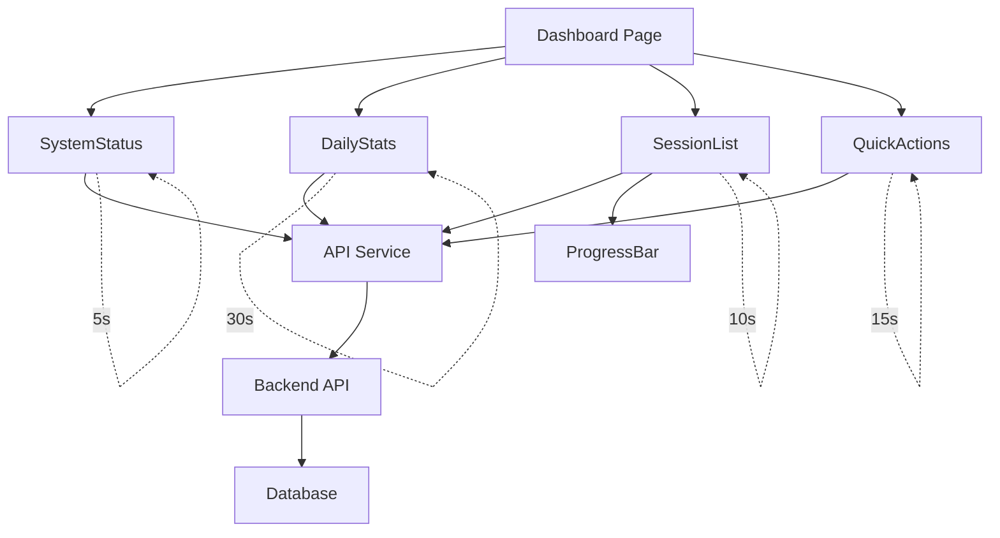
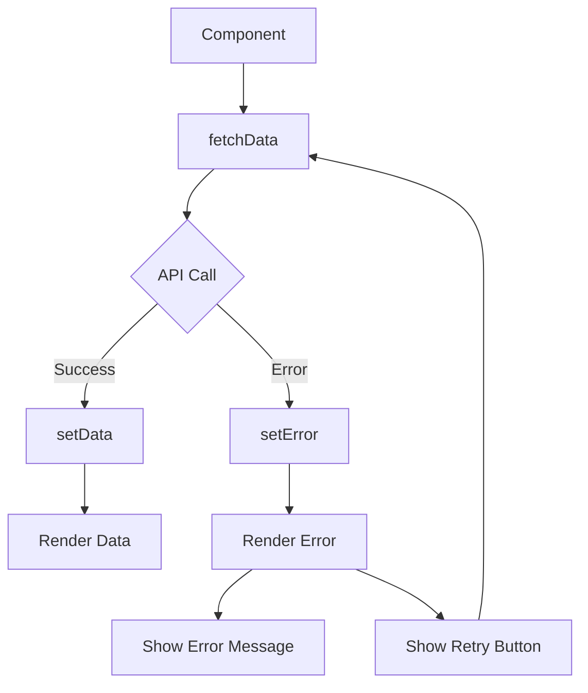
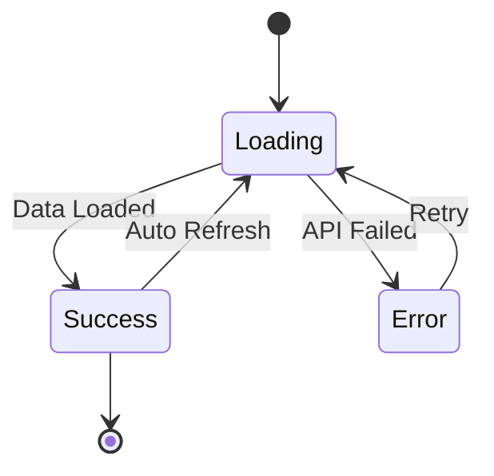
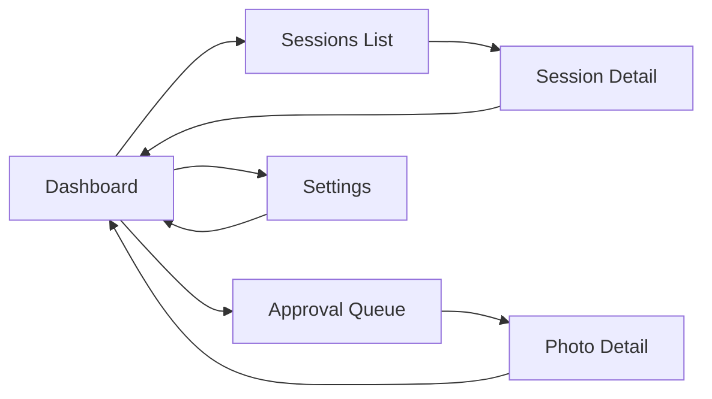

# Mobile Dashboard Architecture

## Component Hierarchy

```
App.js
└── Layout.js
    └── Dashboard.js (Page)
        ├── SystemStatus.js
        │   └── apiService.getSystemStatus()
        │   └── apiService.getResourceStatus()
        │
        ├── DailyStats.js
        │   └── apiService.getDailyStatistics()
        │
        ├── SessionList.js
        │   ├── apiService.getSessions()
        │   └── ProgressBar.js (for each session)
        │
        └── QuickActions.js
            └── apiService.getApprovalQueue()
```

## Data Flow



## State Management

### Component-Level State

Each component manages its own state:

```javascript
// SystemStatus.js
const [status, setStatus] = useState({...});
const [resources, setResources] = useState({...});
const [loading, setLoading] = useState(true);
const [error, setError] = useState(null);

// SessionList.js
const [sessions, setSessions] = useState([]);
const [loading, setLoading] = useState(true);
const [error, setError] = useState(null);

// DailyStats.js
const [stats, setStats] = useState({...});
const [loading, setLoading] = useState(true);
const [error, setError] = useState(null);
```

### Auto-Refresh Pattern

```javascript
useEffect(() => {
  fetchData();
  const interval = setInterval(fetchData, REFRESH_INTERVAL);
  return () => clearInterval(interval);
}, [dependencies]);
```

## API Service Architecture

```
api.js (Singleton)
├── fetch() - Generic wrapper
├── System APIs
│   ├── getSystemStatus()
│   ├── getSystemHealth()
│   └── getResourceStatus()
├── Session APIs
│   ├── getSessions()
│   ├── getSessionDetail()
│   └── deleteSession()
├── Statistics APIs
│   ├── getDailyStatistics()
│   ├── getWeeklyStatistics()
│   └── getMonthlyStatistics()
└── Approval APIs
    ├── getApprovalQueue()
    ├── approvePhoto()
    └── rejectPhoto()
```

## Styling Architecture

```
App.css (Global Styles)
├── Layout Styles
│   ├── .App
│   ├── .page-transition
│   └── Responsive breakpoints
├── Component Styles
│   ├── .card
│   ├── .btn (primary, secondary, danger)
│   ├── .badge (success, warning, error, info)
│   └── .progress-bar
└── Utility Classes
    ├── .text-primary-600
    ├── .bg-primary-600
    └── Mobile optimizations
```

## Error Handling Flow



## Loading States



## Navigation Flow



## Performance Optimization

### 1. Component Rendering
- Use React.memo for expensive components
- Implement proper dependency arrays in useEffect
- Avoid unnecessary re-renders

### 2. API Calls
- Stagger refresh intervals
- Implement request cancellation
- Cache responses when appropriate

### 3. Bundle Size
- Code splitting by route
- Lazy load heavy components
- Tree-shake unused code

## Security Considerations

### 1. API Communication
- HTTPS in production
- CORS configuration
- API authentication (JWT)

### 2. Data Handling
- Sanitize user inputs
- Validate API responses
- Handle sensitive data properly

### 3. Error Messages
- Don't expose internal errors
- Log errors securely
- Provide user-friendly messages

## Accessibility

### 1. Semantic HTML
- Proper heading hierarchy
- ARIA labels where needed
- Keyboard navigation support

### 2. Visual Design
- Sufficient color contrast
- Touch-friendly targets (44x44px)
- Clear focus indicators

### 3. Screen Reader Support
- Alt text for images
- Descriptive button labels
- Status announcements

## Testing Strategy

### 1. Unit Tests
```javascript
// SystemStatus.test.js
test('renders system status correctly', () => {
  // Test component rendering
});

test('handles API errors gracefully', () => {
  // Test error handling
});
```

### 2. Integration Tests
```javascript
// Dashboard.test.js
test('dashboard loads all components', () => {
  // Test full dashboard
});

test('auto-refresh works correctly', () => {
  // Test refresh mechanism
});
```

### 3. E2E Tests
```javascript
// dashboard.e2e.js
test('user can navigate from dashboard to sessions', () => {
  // Test navigation flow
});
```

## Deployment Architecture

```
Production Build
├── index.html (Entry point)
├── static/
│   ├── css/
│   │   └── main.[hash].css
│   └── js/
│       ├── main.[hash].js
│       └── [chunk].[hash].js
├── service-worker.js (PWA)
└── manifest.json (PWA)
```

## Future Enhancements

### Phase 1: WebSocket Integration
- Replace polling with WebSocket
- Real-time updates
- Reduced server load

### Phase 2: Offline Support
- Service Worker caching
- IndexedDB for data storage
- Sync when online

### Phase 3: Advanced Features
- Dark mode
- Customizable dashboard
- Advanced filtering
- Export functionality

## Monitoring & Analytics

### Key Metrics
1. **Performance**
   - Page load time
   - API response time
   - Component render time

2. **User Engagement**
   - Active users
   - Session duration
   - Feature usage

3. **Errors**
   - API failures
   - Component errors
   - Network issues

### Logging Strategy
```javascript
// Log levels
- ERROR: Critical failures
- WARN: Recoverable issues
- INFO: Important events
- DEBUG: Detailed information
```

## Maintenance

### Regular Tasks
1. Update dependencies monthly
2. Review and optimize performance
3. Check for security vulnerabilities
4. Update documentation

### Version Control
- Semantic versioning (MAJOR.MINOR.PATCH)
- Changelog maintenance
- Git tags for releases

---

**Document Version**: 1.0.0  
**Last Updated**: 2025-11-09  
**Status**: ✅ Current
